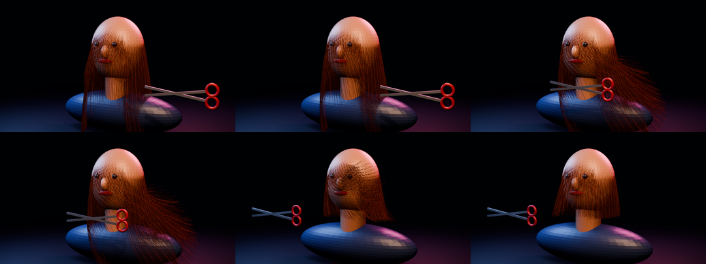

# Mannequin hair and primitive haircut

This showcase turns the wind-garden's seven native Box3D hanging-fiber
trajectories into a dense procedural groom on a studio mannequin. The final
render uses 1,200 fine curve fibers with Principled Hair shading. At two
seconds, a visible scissors proxy crosses the cut plane, the attached groom is
shortened to a bob, and the detached lengths fall away.

```sh
just mannequin-haircut
```

The four-second, 24 fps bake writes an MP4, contact sheet, render receipt, and
separate Blender/ffmpeg telemetry under
`physics/outputs/mannequin_haircut_telemetry/`. The compact device-scoped
result is tracked at `docs/receipts/mannequin_haircut.telemetry.json`.



## Controls

The Blender renderer accepts `--fibers`, `--points`, `--cut-time`, and
`--cut-height`. Hair placement and cutting are deterministic, and their small
pure-Python geometry layer is covered by `scripts/test_haircut_math.py`.

## Claim boundary

Box3D supplies seven sparse wind guides. The dense groom interpolates those
guides in Blender. Cutting is a deterministic visual state transition at a
plane; the scissors do not detect contacts, and the falling cut portions use a
simple visual gravity curve. This is not continuum hair mechanics, collision-
aware strand dynamics, strand self-contact/friction, or a physical cutting
simulation.
