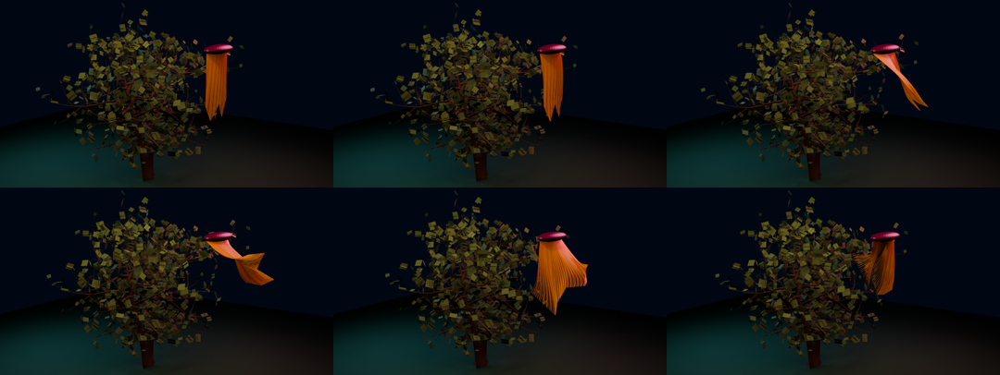

# SeedThree wind canopy and guide groom

This showcase maps the native Box3D wind-garden trajectories onto two richer
visual surfaces:

- 28 sparse tree guides drive the real SeedThree White Oak branch mesh and
  1,664 foliage-card objects through normalized inverse-distance weights;
- seven physical hanging-strand guides interpolate into 127 rendered curve
  fibers, retaining the measured guide phases while making the bundle read as
  a groom rather than seven ropes.

```sh
just seedthree-wind
```

The four-second, 24 fps bake writes an MP4, contact sheet, render receipt, and
separate Blender/ffmpeg telemetry under
`physics/outputs/seedthree_wind_canopy_telemetry/`.
The compact device-scoped result is tracked at
`docs/receipts/seedthree_wind_canopy.telemetry.json`.



## Claim boundary

Box3D supplies the sparse guide motion. Canopy skinning, leaf flutter, and
between-guide hairs are visual interpolation in Blender and do not feed back
into the simulation. This is not per-vertex FEM, production tree rigging, CFD,
two-way aerodynamics, continuum hair mechanics, or strand self-contact and
friction.
