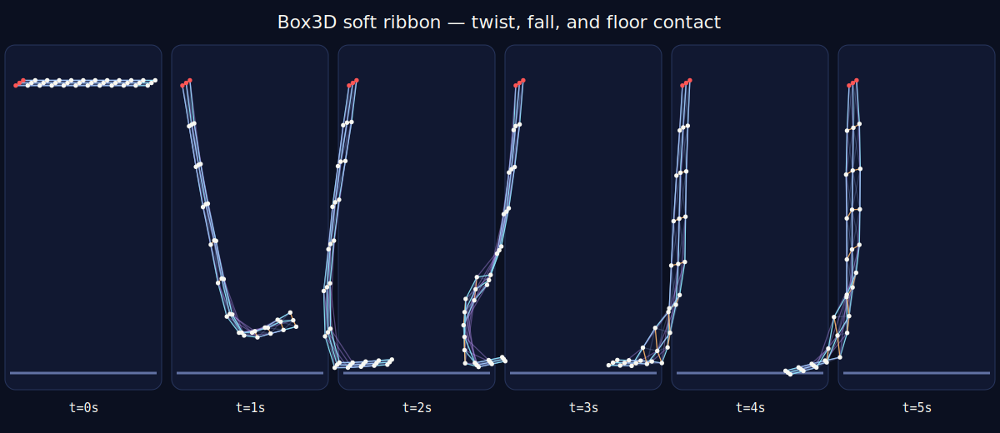

# Realtime Box3D soft ribbon

This is a deliberately small, visual soft-structure experiment built from the
public Box3D C API. Thirty-six spherical bodies form a three-node-wide ribbon.
Warp, weft, shear, and longer-range bend springs let the free end twist, sag,
and strike a native Box3D floor while the first edge remains pinned.

Run it with:

```sh
just soft-ribbon
```

Render the neon Eevee animation with:

```sh
just soft-ribbon-video
```

The command compiles and tests the C fixture, simulates five seconds at 60 Hz
with four substeps, samples 151 frames at 30 Hz, and writes:

- `physics/labs/soft_ribbon/outputs/soft_ribbon.motion.json` for replay;
- `physics/labs/soft_ribbon/outputs/receipt.json` for structural checks;
- `physics/labs/soft_ribbon/outputs/performance.json` for measured CPU time and
  real-time factor;
- `docs/images/soft_ribbon_preview.svg` for a dependency-free review.



The node count is intentionally modest. This slice establishes attractive,
deterministic deformable motion and native contact before measuring whether a
larger fixture is useful.

## Claim boundary

This is a spring lattice, not FEM, JGS2, Cubature, a continuum material model,
or an orbital-tether solver. It does not modify Box3D's production solver. The
separate compliance-chain lab remains the numerical convergence microscope;
the two experiments must not be described as one integrated algorithm.
