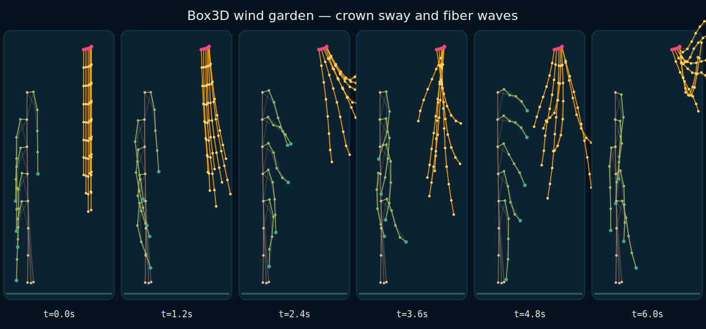

# Native Box3D wind garden

The wind garden places two deliberately different compliant structures in one
force field: a small rooted tree proxy with five branches, and seven unequal
hanging fiber strands. Position- and time-dependent gusts travel through both,
making crown sway, strand lag, and phase differences easy to see.

```sh
just wind-garden
just wind-garden-video
```

The build command gives both wind-on and calm controls a twelve-second gravity
settling pre-roll, checks finite motion and bounded extension, packages a
deterministic replay, and writes a receipt with crown/fiber displacement from
that shared baseline. The video command renders the recorded Box3D trajectory
in Eevee; Blender does not resimulate it.



## Model boundary

The branches and fibers are spherical bodies joined by structural and
skip-one bending springs. Wind is a prescribed body-force field. This is not a
continuum rod, FEM tree, production hair groom, fluid simulation, two-way
aerodynamic coupling, or strand self-contact/friction model.
